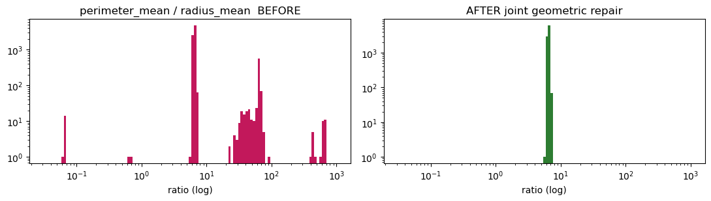
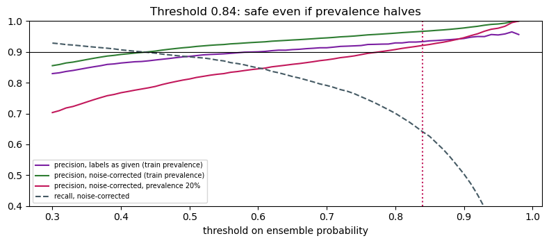

# Pink AI 2026 — Malignant vs Benign from FNA Measurements

**Relax Team** solution for the Pink AI 2026 Data Camp competition: clean a deliberately messy
breast-tumour dataset (fine needle aspirate measurements), train a model that separates malignant
from benign, and pick a decision threshold that survives a shifted test set.

**Team:** Yousef Shabib · Ahmad Irshaid · Sarah Alzaro

## Highlights

- **Structural repairs, not row deletion.** Found perimeter/area values swapped in 158 rows and radius
  recorded in cm in 1,378 cells, using geometry (`P ≈ 2πR`, `A ≈ πR²`). Rows with an impossible
  perimeter/radius ratio went from 10.4% to 0%, with no rows dropped.
- **Duplicates and conflicting labels.** After normalising patient IDs, 346 patients appeared twice
  (50 with opposite diagnoses). They were merged and the labels repaired.
- **Leakage audit.** `biopsy_followup_code` is written *after* the diagnosis and gives AUC 0.971 on
  its own, so it was dropped.
- **Patient-grouped validation.** `StratifiedGroupKFold` (5 folds × 3 repeats) grouped by the
  normalised patient ID, with an assertion that no patient lands in both train and validation.
- **Threshold under stress.** `t = 0.84`, chosen so precision stays ≥ 0.92 even after removing label
  noise and halving prevalence, because the brief warned the test set is drawn differently.
- **Cleaning pays off.** Repairs raise the linear model's recall@P90 from 0.547 to 0.761.

| Geometry before / after repair | Threshold under stress |
| --- | --- |
|  |  |

## Pipeline

load → clean context columns → parse numbers → cell repairs → structural repairs (geometry) →
duplicates and label conflicts → leakage audit → model (logistic regression + gradient boosting,
patient-grouped CV) → threshold under stress → submission → evidence sheet

The full write-up of every decision is in [`evidence_sheet.md`](evidence_sheet.md), and every number
in it is printed by the notebook.

## Run it

```bash
pip install -r requirements.txt
jupyter notebook PinkAI_Solution.ipynb
```

The competition data (`pinkai_train.csv`, `pinkai_test.csv`, `sample_submission.csv`) belongs to the
organisers and is not included in this repo. Put those files next to the notebook to run it top to
bottom.
